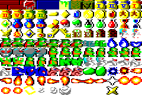

# SOLOMON'S KEY

Reference:
 * [MobyGames](https://www.mobygames.com/game/13104/solomons-key/)
 * [GameFAQs](https://gamefaqs.gamespot.com/cpc/941044-solomons-key)
 * [The Spriters-
  Resource](https://www.spriters-resource.com/amstrad_cpc/solomonskey/sheet/110361/)
 * [Strategy Wiki](https://strategywiki.org/wiki/Solomon's_Key)

## Description

Solomon's Key is a platform game with both action and strategy elements. On each level your goal is to retrieve a key which can then be used to unlock the exit. To help out, you have a magic wand which can be used to create and destroy blocks (though some blocks can't be destroyed). In order to reach the key you will need carefully to arrange the blocks on the screen so you can jump your way around safely. Wandering around each level are a variety of enemies which will cause you to lose a life if you're caught. Some creatures can be killed by destroying the block they are standing on, others must be dodged. Hidden bonuses and magic can be found on many of the levels, sometimes even hidden in blocks. Some treasures give you bonus points, others can form magic spells to help deal with the enemies. To make the game more difficult, each level has a time limit in which it must be completed.

## AMSTRAD CPC Version

 * Screen Resolution: 320 x 200.    
 * Tile Resolution: (20 x 16) - smaller icons (12 x 8)    
 * Tilelayer Size: (15 x 12) - 16px left on the right border and 8p left on bottom border.

### Tileset

   
Tileset

### Screenshot

   
Splash Screen

   
Title Screen

   
Main Menu

   
Points Menu

   
High Score Menu

   
SpriteSheet